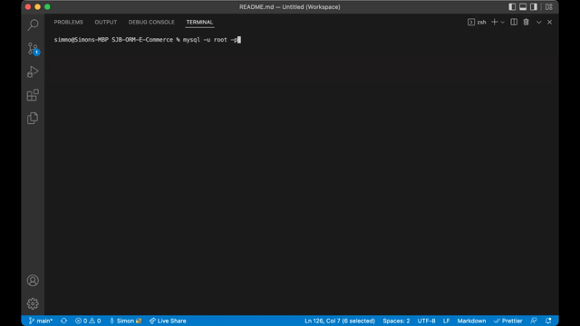

# (ORM): E-Commerce Back End (SJB-ORM-E-Commerce)

## Description

This application is the back end for an e-commerce site. Developed using starter code, it uses Sequelize to interact with a MySQL database to view, create, update and delete Products/Categories/Tags.

## User Story

```md
AS A manager at an internet retail company
I WANT a back end for my e-commerce website that uses the latest technologies
SO THAT my company can compete with other e-commerce companies
```

## Preview

###### Create Database, Seed data and start the application’s server



###### Example of GET routes for all categories, all products, and all tags


###### Example of GET routes for a single category/product and a single tag


###### Example of POST, PUT, and DELETE routes - Product


More in the Wwalkthrough videos

## Installation

###### Local Installation

- Clone the repository from [Github](git@github.com:simmmmo/SJB-ORM-E-Commerce.git)
- Ensure Node.js is installed
- Ensure MySQL is installed
- Install dependencies
  [express package](https://www.npmjs.com/package/express)

```bash
npm i
```

```bash
npm i sequelize
```

```bash
npm i mysql2
```

```bash
npm i dotenv
```

- Create .env file in the root directory and add local SQL credentials

```bash
DB_USER='YourUser'
DB_PW='YourPW'
DB_NAME='ecommerce_db'
```

- Log into MySQL and import DB schema file

```bash
mysql -u root -p

source db/schema.sql

```

- Run Seed once the database has be created to populate seed data to your database

```bash

npm run seed

```

## Usage

###### Local Environment

Run

```bash
npm start
```

Open Insomnia App

Run GET, POST, PUT and DELETE requests in Insomnia with

```bash
localhost:3001/api/tags

localhost:3001/api/products

localhost:3001/api/categories
```

Add "/" With the ID number to request product/category/tags by ID

Example of Create new Product data

```bash
{
  "product_name": "Flower T-Shirt",
	"price": 15,
	"stock": 16,
	"tagIds": [1, 2, 3, 4]
}
```

###### Additional information

- Note - Before starting application, ensure MySQL credentials have been updated in .env

## Technology

- Node.js
- Express.js
- MySQL
- Sequelize
- dotenv

## Project Links

###### Walkthrough video links

Create the schema, seed the database and start the application’s server

https://drive.google.com/file/d/12YRacAU-IMLZpRu4yylJ5MYXjNBbf4RA/view

GET routes for all categories, all products, and all tags being tested in Insomnia.

https://drive.google.com/file/d/1uYWmZXIg1jnMb9WKvABVQJHkU3tPY-Fc/view

GET routes for a single category, a single product, and a single tag being tested in Insomnia.

https://drive.google.com/file/d/1-sy8OtR_qf7pu9d0PVJBo9S8EIRbFvKj/view

POST, PUT, and DELETE routes for categories, products, and tags being tested in Insomnia.

- Categories

https://drive.google.com/file/d/17PdfHaXdIt2g5zChb5Nty4DCNF4pqsut/view

- Product

https://drive.google.com/file/d/1UrTUyEyhvSxoK_XJmGVL9VsmvTKVjv2t/view

- TAGS

https://drive.google.com/file/d/1nt9PLN_WTxw7t5UvoVdYoxEAU_optsk6/view

###### Repo name

- SJB-ORM-E-Commerce

###### GitHub enviroment

- https://github.com/simmmmo/SJB-ORM-E-Commerce
- git@github.com:simmmmo/SJB-ORM-E-Commerce.git
